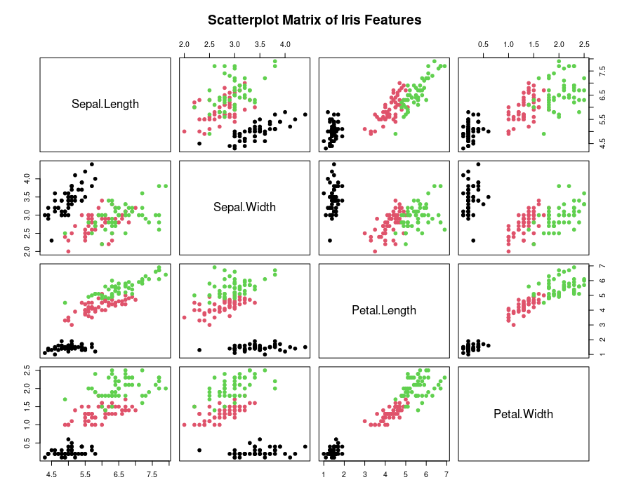

# Mini-Project-Analysis-of-the-Iris-Dataset-in-R
library(psych)
# Question 1: Data Import and Exploration:
 # I: Load the iris dataset
data("iris")
# II: Display the first five rows
head(iris,2)
Sepal.Length Sepal.Width Petal.Length Petal.Width Species
1          5.1         3.5          1.4         0.2  setosa
2          4.9         3.0          1.4         0.2  setosa
3          4.7         3.2          1.3         0.2  setosa
4          4.6         3.1          1.5         0.2  setosa
5          5.0         3.6          1.4         0.2  setosa
tail(iris,5)
Sepal.Length Sepal.Width Petal.Length Petal.Width   Species
146          6.7         3.0          5.2         2.3 virginica
147          6.3         2.5          5.0         1.9 virginica
148          6.5         3.0          5.2         2.0 virginica
149          6.2         3.4          5.4         2.3 virginica
150          5.9         3.0          5.1         1.8 virginica
# View the structure of the dataset
describe(iris)
             vars   n mean   sd median trimmed  mad min max range  skew kurtosis   se
Sepal.Length    1 150 5.84 0.83   5.80    5.81 1.04 4.3 7.9   3.6  0.31    -0.61 0.07
Sepal.Width     2 150 3.06 0.44   3.00    3.04 0.44 2.0 4.4   2.4  0.31     0.14 0.04
Petal.Length    3 150 3.76 1.77   4.35    3.76 1.85 1.0 6.9   5.9 -0.27    -1.42 0.14
Petal.Width     4 150 1.20 0.76   1.30    1.18 1.04 0.1 2.5   2.4 -0.10    -1.36 0.06
Species*        5 150 2.00 0.82   2.00    2.00 1.48 1.0 3.0   2.0  0.00    -1.52 0.07
str(iris)
'data.frame':	150 obs. of  5 variables:
 $ Sepal.Length: num  5.1 4.9 4.7 4.6 5 5.4 4.6 5 4.4 4.9 ...
 $ Sepal.Width : num  3.5 3 3.2 3.1 3.6 3.9 3.4 3.4 2.9 3.1 ...
 $ Petal.Length: num  1.4 1.4 1.3 1.5 1.4 1.7 1.4 1.5 1.4 1.5 ...
 $ Petal.Width : num  0.2 0.2 0.2 0.2 0.2 0.4 0.3 0.2 0.2 0.1 ...
 $ Species     : Factor w/ 3 levels "setosa","versicolor",..: 1 1 1 1 1 1 1 1 1 1 ...
# Question 2: Data Visualisation:
#I: Create a pair plot(scatterplot matrix) to visualize the 
# relationship between the different features (sepal length, sepal width, petal 
# length and petal width)
png("iris_pairs_plot.png", width=800, height=800)  # save as image
pairs(iris[, 1:4],
      main = "Scatterplot Matrix of Iris Features",
      pch = 19,
      col = iris$Species)
dev.off()
Below is the scatterplot matrix generated by the above R code:

# II: Use boxplot to visualise the distribution of each feature across three 
# species
# Boxplot for all features
# Arranging plots into two rows and two columns(2x2 Grid)
png("iris_boxplots.png", width=800, height=800)  # save as image

